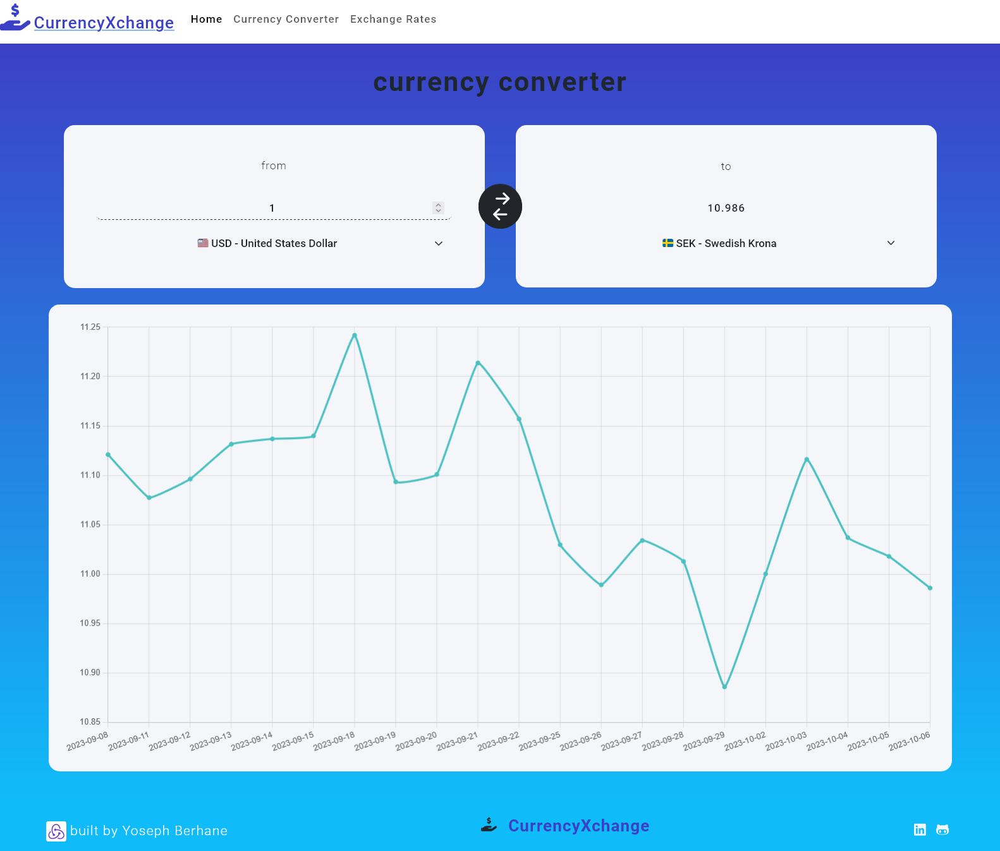

# CurrencyXchange



## Table of Contents
- [CurrencyXchange](#currencyxchange)
  - [Table of Contents](#table-of-contents)
  - [Overview](#overview)
  - [Features](#features)
  - [Installation](#installation)
  - [Usage](#usage)
  - [Contributing](#contributing)

## Overview
CurrencyXchange is a robust and user-friendly application designed for real-time currency conversion and exchange rate information. With a sleek and intuitive interface, it provides users with accurate and up-to-date financial data.

## Features
- **Real-Time Exchange Rates**: Fetches the latest exchange rates from reliable financial APIs.
- **Currency Converter**: Allows users to convert amounts between different currencies effortlessly.
- **Interactive Charts**: Visualize historical exchange rate data with responsive and interactive charts.
- **Support for Multiple Currencies**: Extensive support for various global currencies.

## Installation
1. Clone the repository:
   ```sh
   git clone https://github.com/your-username/CurrencyXchange.git
   cd CurrencyXchange
   npm install
   npm start

## Usage
- **Select a Base Currency**: Choose a base currency and input an amount to initiate conversion.
- **Exchange Rates Table**: View a comprehensive table displaying exchange rates corresponding to the selected base currency.
- **Currency Converter**: Utilize the converter tool to calculate and compare amounts in various currencies.

## Contributing
I welcome contributions from the community. 
