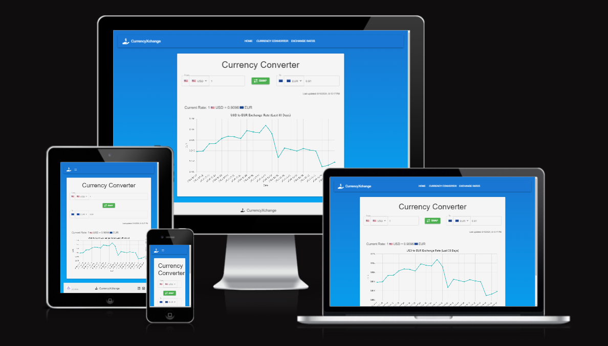

# CurrencyXchange



CurrencyXchange is a robust and user-friendly application designed for real-time currency conversion and exchange rate information. With a sleek and intuitive interface, it provides users with accurate and up-to-date financial data.

## Table of Contents

- [CurrencyXchange](#currencyxchange)
  - [Table of Contents](#table-of-contents)
  - [Features](#features)
  - [Demo](#demo)
  - [Installation](#installation)
  - [Contributing](#contributing)
  - [Contact](#contact)

## Features

- **Real-Time Exchange Rates**: Fetches the latest exchange rates from reliable financial APIs.
- **Currency Converter**: Allows users to convert amounts between different currencies effortlessly.
- **Interactive Charts**: Visualize historical exchange rate data with responsive and interactive charts.
- **Support for Multiple Currencies**: Extensive support for various global currencies.
- **Responsive Design**: Optimized for both desktop and mobile devices.
- **Offline Support**: Basic functionality available without an internet connection.

## Demo

[Live Demo](https://currency-x-change.netlify.app/) - Experience CurrencyXchange in action!

## Installation

1. Clone the repository:

   ```sh
   git clone https://github.com/yosephdev/currency-converter-app.git 

2. Navigate to the project directory:

   ```sh
   cd currency-converter-app

3. Install dependencies:

   ```sh
   npm install

4. Start the development server:

   ```sh
   npm start

## Usage

- **Select a Base Currency**: Choose a base currency and input an amount to initiate conversion.
- **View Exchange Rates**: The app will display current exchange rates for various currencies.
- **Currency Conversion**: Utilize the converter tool to calculate and compare amounts in various currencies.
- **Explore Charts**: Navigate to the charts section to view historical exchange rate trends.

## Technologies Used

- React.js
- Chart.js
- Material-UI
- Frankfurter API for exchange rates

## API Reference

This project uses the Frankfurter API for fetching real-time and historical exchange rate data.

Example API call:

```sh
GET https://api.frankfurter.app/latest?from=USD
```

## Contributing

Contributions are what make the open-source community such an amazing place to learn, inspire, and create. Any contributions you make are greatly appreciated.

1. Fork the Project
2. Create your Feature Branch (`git checkout -b feature/AmazingFeature`)
3. Commit your Changes (`git commit -m 'Add some AmazingFeature'`)
4. Push to the Branch (`git push origin feature/AmazingFeature`)
5. Open a Pull Request

## Contact

Yoseph Berhane - contact@yoseph.dev

Project Link: [https://github.com/yosephdev/currency-converter-app](https://github.com/yosephdev/currency-converter-app)
